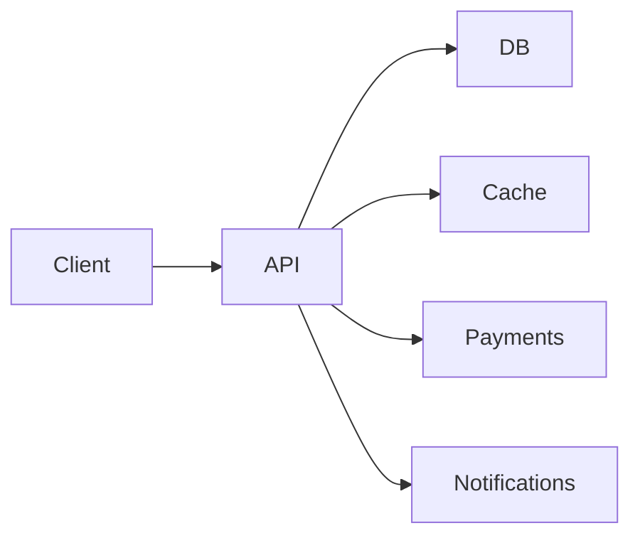

# Architecture Overview

- High-level system context
- Services: API, Frontend, Payments, Escrow, Auth, Notifications
- Data stores: relational DB, cache, object storage

```mermaid
flowchart LR
  Client --> API --> DB
  API --> Cache
  API --> Payments
  API --> Notifications
```
