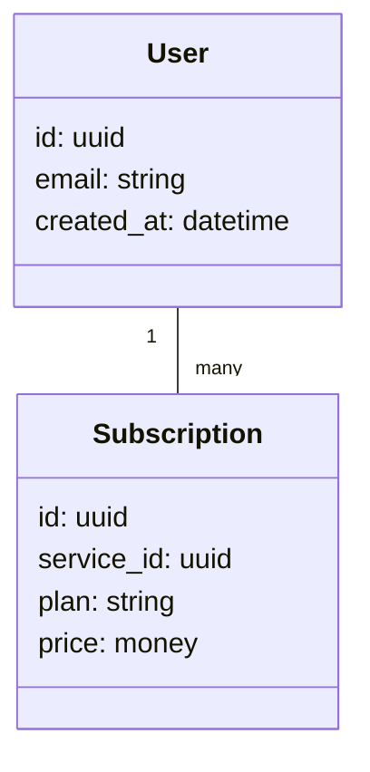

# Data Model

```mermaid
classDiagram
  class User {
    id: uuid
    email: string
    created_at: datetime
  }
  class Subscription {
    id: uuid
    service_id: uuid
    plan: string
    price: money
  }
  User "1" -- "many" Subscription
```
